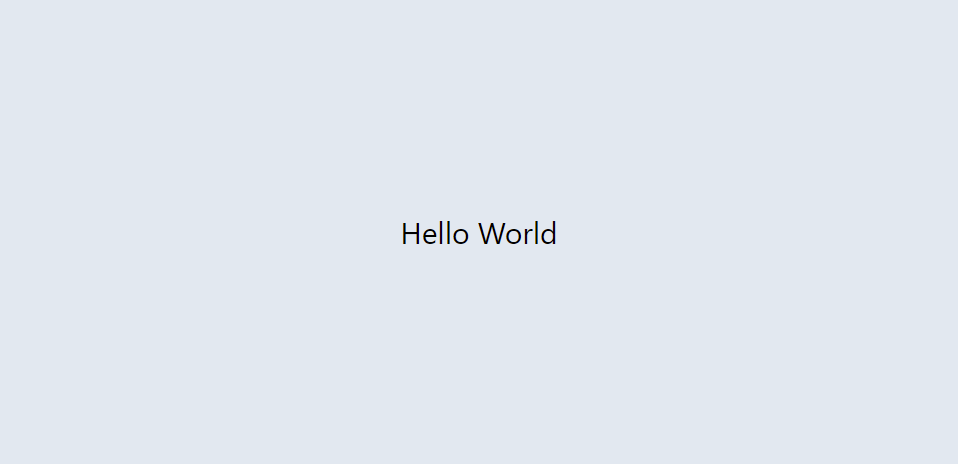

# 001-hello-world
画面中央に"Hello World"を表示します。

## 利用技術
- Next.js 14.0.3
- Tailwind CSS 3.3.5
- TypeScript 5.3.2

## 参考
- [【Reactアプリ100本ノック】01 Hello World](https://qiita.com/Sicut_study/items/3c5cd798313854a471a0)